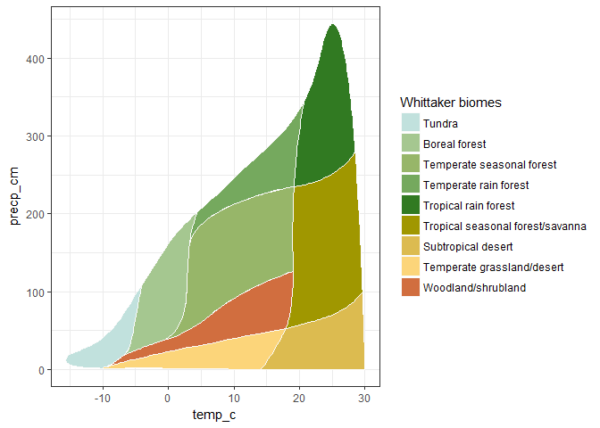

# plotbiomes

<!-- CI badges -->
[](https://ci.appveyor.com/project/valentinitnelav/plotbiomes/branch/develop)
[](https://travis-ci.org/valentinitnelav/plotbiomes)
[](https://codecov.io/github/valentinitnelav/plotbiomes?branch=master)

<!--
Fixing errors from Travis CI can be time consuming ... 
I gave up since the effort to fix the errors is not worth the time!
The AppVeyor passes gracefully and that is enough for me.
In Travis, last errors came from `sf` package due to `GDAL` problems
I tried some suggestions from here: https://stackoverflow.com/a/12143411/5193830 
but could not fix it...
-->

## Overview

R package for plotting [Whittaker' biomes](https://en.wikipedia.org/wiki/Biome#Whittaker_.281962.2C_1970.2C_1975.29_biome-types) with [ggplot2](https://github.com/tidyverse/ggplot2).

The original graph is Figure 5.5 in *Ricklefs, R. E. (2008), The economy of nature. W. H. Freeman and Company.* (Chapter 5, Biological Communities, The biome concept). The figure was processed and brought into an R friendly format. Details are given in [Whittaker_biomes_dataset.html](https://rawgit.com/valentinitnelav/plotbiomes/master/html/Whittaker_biomes_dataset.html) document.

Plotting Whittaker' biomes was also addressed in [BIOMEplot](https://github.com/kunstler/BIOMEplot) package by Georges Kunstler and in [ggbiome](https://github.com/guillembagaria/ggbiome) package by Guillem Bagaria, Victor Granda and Georges Kunstler.

## Installation

You can install `plotbiomes` from github with:

``` r
# install.packages("devtools")
devtools::install_github("valentinitnelav/plotbiomes")
```

## Examples & Vignettes

Check examples at [Whittaker_biomes_examples.html](https://rawgit.com/valentinitnelav/plotbiomes/master/html/Whittaker_biomes_examples.html) and [Check_outliers.html](https://rawgit.com/valentinitnelav/plotbiomes/master/html/Check_outliers.html) vignettess. 

Simple example of plotting Whittaker' biomes:

``` r
library(plotbiomes)

whittaker_base_plot()
```

<!--
library(ggplot2)
ggsave(filename = "man/figures/README-example-1.png", dpi = 75)
-->


